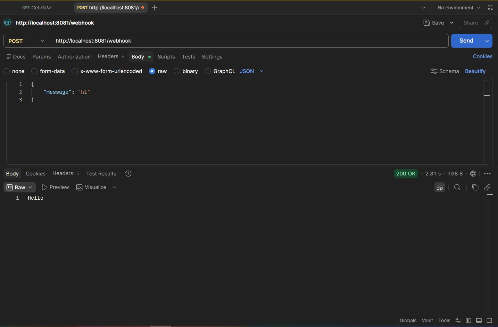
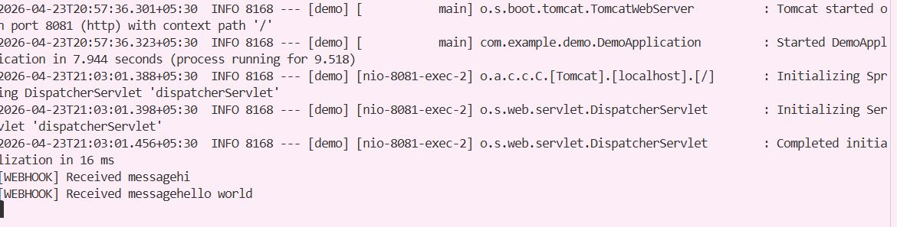

# Spring Boot Webhook API

## 📌 Description
This project is a simple REST API built using Spring Boot.  
It accepts POST requests at `/webhook` and responds based on user input.

## 🚀 Endpoint
POST /webhook

## 🧪 Sample Input
{
  "message": "hi"
}

## ✅ Responses
- hi → Hello
- bye → Goodbye
- others → I don't understand

## 🛠 Tech Used
- Java
- Spring Boot
- Postman (for testing)

## ▶️ How to Run
1. Run DemoApplication.java
2. Use Postman:
   POST http://localhost:8081/webhook

## 📷 Screenshots

### Spring Boot Running
.JPG)

### Postman Hi Response

### Backend Console Logs

